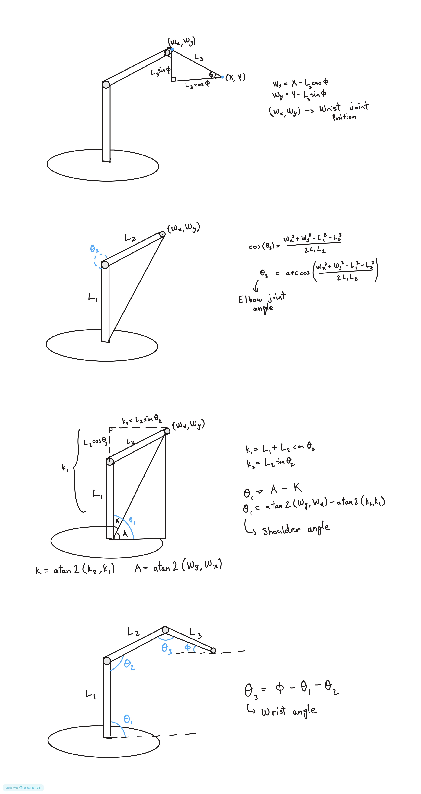

# Inverse Kinematics for 3-DOF Planar Robot Arm

This system utilizes Kinematic Decoupling. By specifying a target coordinate $(X, Y)$ and a desired approach angle $(\phi)$, we calculate the wrist joint's position first. Reducing the 3-link problem into a standard 2-link geometric calculation for the shoulder and elbow.

## System Constants
Lengths are measured between the exact axes of rotation in millimeters.

* **$L_1$ (Shoulder to Elbow):** 97.37 mm
* **$L_2$ (Elbow to Wrist):** 86.93 mm
* **$L_3$ (Wrist to End Effector):** 147.90 mm

## 1. Kinematic Decoupling (Wrist Position)
Given the target $(X, Y)$ and approach angle $\phi$ , the required position of the wrist joint $(W_x, W_y)$ is found by moving backward from the end effector.

$$W_x = X - L_3 \cos(\phi)$$

$$W_y = Y - L_3 \sin(\phi)$$

## 2. Elbow Angle ($\theta_2$) Calculation
With the wrist position known, the Law of Cosines is used to solve the 2-link chain formed by $L_1$ and $L_2$.

$$\cos(\theta_2) = \frac{W_x^2 + W_y^2 - L_1^2 - L_2^2}{2 L_1 L_2}$$

$$\theta_2 = \arccos(\cos(\theta_2))$$

## 3. Shoulder Angle ($\theta_1$) Calculation
The shoulder angle is calculated by finding the angle to the wrist coordinate and subtracting the inner triangle geometry formed by the elbow bend.

$$k_1 = L_1 + L_2 \cos(\theta_2)$$

$$k_2 = L_2 \sin(\theta_2)$$

$$\theta_1 = \text{atan2}(W_y, W_x) - \text{atan2}(k_2, k_1)$$

## 4. Wrist Angle ($\theta_3$) Calculation
The wrist servo angle is calculated to ensure the end effector maintains the requested global approach angle $\phi$, compensating for the rotation of the shoulder and elbow.

$$\theta_3 = \phi - \theta_1 - \theta_2$$

Substituting the system constants: 

$$\theta_1 = \text{atan2}(Y, X) - \text{atan2}(222.9 \sin(\theta_2), 97.4 + 222.9 \cos(\theta_2))$$
